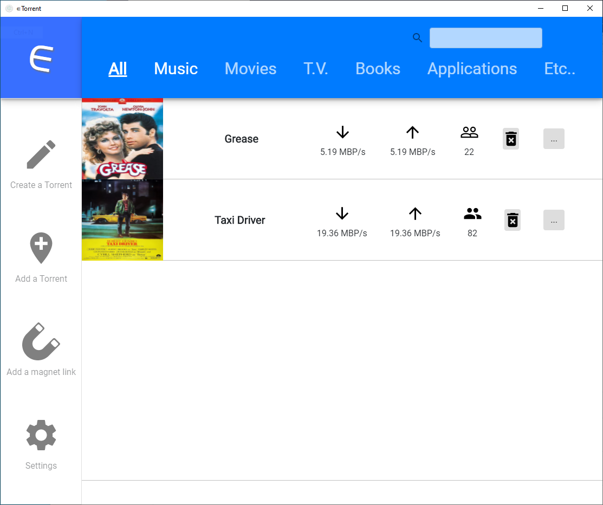
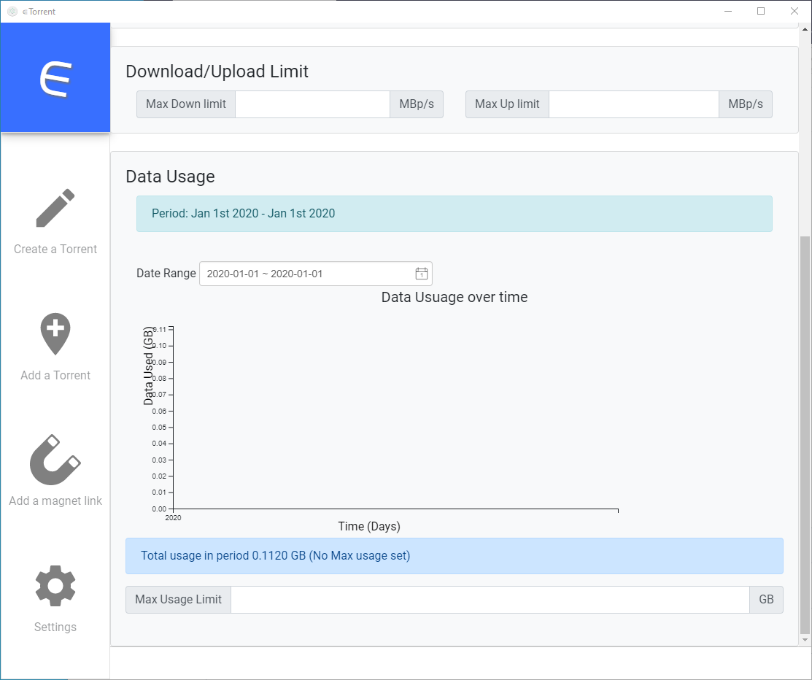

# Make Torrents Great Again

A better Torrent Client.

Sample images

## Overview

An exploration of modern BitTorrent clients, with an emphasis on user interface design. We critique uTorrent, Deluge, and other popular clients, in order to make a case for bringing a new competitor to market. We find that current BitTorrent clients are cluttered with an overwhelming amount of information and advanced features which are irrelevant for a large majority of users. We propose a torrenting client that features a use-case centric workflow in order to give casual users an effective and simple way to download BitTorrent files.

## Developing

[See development documents](DEVELOPING.md)
